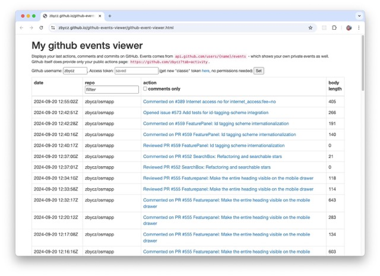

# github-events-viewer 📆 
**aka "What did I do yesterday?"**

Displays events from `http://api.github.com/users/{name}/events` - that means including events on your private repos. Github itself does provide only your public actions on your profile.

- **[LIVE VERSION](https://zbycz.github.io/github-events-viewer/github-event-viewer.html)** (from master)

## Hidden Options

- `?date=today|yesterday|this-week` - filter events by date

## NO realtime data
As stated in the [docs](https://docs.github.com/en/rest/activity/events?apiVersion=2022-11-28#list-events-for-the-authenticated-user):
> The API is not built to serve real-time use cases. Depending on the time of day, event latency can be anywhere from 30s to 6h.

## Author and licence

(c) 2016,2017,2024 [Pavel Zbytovský](http://zby.cz)

Licenced under MIT license.

## See also

- this code was formerly part of [OctoMate chrome extension](https://github.com/rubyerme/chrome-github-mate#octo-mate) (called Github Mate before)
- [github-event-viewer](https://github.com/meganemura/github-event-viewer) - for (public) repo events
- more useful links in this Hackernews post: https://news.ycombinator.com/item?id=41609246
